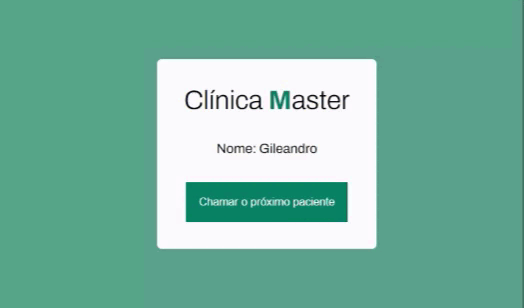

<h1 text="center"></h1>

## Chamada de paciente de uma clínica

A aplicação de chamada de paciente é um sistema utilizado em consultórios médicos, clínicas e hospitais para organizar a ordem de atendimento dos pacientes.

## Tecnologia Utilizada

- Javascript
- HMTL
- CSS

## Acesse o projeto

 <h3>
        <a href="https://lyrisnunes.github.io/chamada-paciente/"> - Veja o projeto clique aqui </a>
</h3>